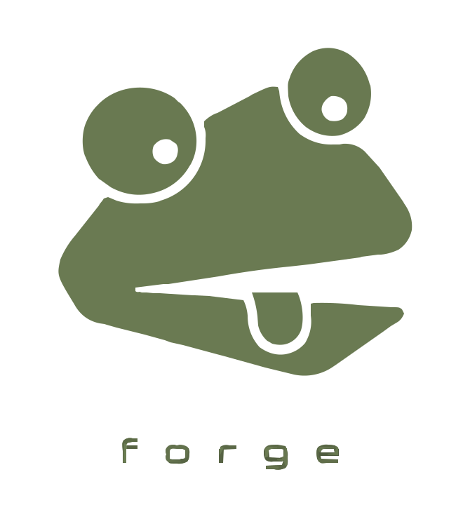

<p align="center">
  <picture>
    
  </picture>
</p>

# forge

[](https://www.npmjs.com/package/@lzear/forge)
[](https://github.com/lzear/forge/commits/main)
[](https://app.codacy.com/gh/lzear/forge)
[](https://app.codacy.com/gh/lzear/forge)
[](LICENSE)
[](https://github.com/lzear/forge)

> Shared dev tooling, configs, and standards for all lzear repos.

## Packages

- **[`@lzear/forge`](packages/forge)** — Umbrella: one dep for everything + `forge` CLI

- **[`@lzear/configs`](packages/configs)** — tsconfig, vitest, tsup, vite, commitlint configs

- **[`@lzear/eslint-config`](packages/eslint-config)** — ESLint flat config
  
- **[`@lzear/repo-lint`](packages/repo-lint)** — Repo compliance checker
  

## Usage

```sh
yarn add -D @lzear/forge
```

```sh
yarn forge check          # audit this repo against forge standards
yarn forge setup          # check and set required GitHub secrets
yarn forge sync           # pull shared files from forge into this repo
```

### `@lzear/eslint-config`

```sh
yarn add -D @lzear/eslint-config eslint
```

**Minimal `eslint.config.ts`:**

```ts
import lzearConfig from '@lzear/eslint-config'

export default await lzearConfig()
```

**With options** — disable feature sets you don't use:

```ts
import lzearConfig from '@lzear/eslint-config'

export default await lzearConfig({
  react: false,    // not a React project
  vitest: false,   // no tests
})
```

Available options (all default to `true`): `node`, `react`, `typescript`, `vitest`.

**Extend with extra rules, overrides, and ignores:**

```ts
import type { Linter } from 'eslint'
import lzearConfig from '@lzear/eslint-config'

const base = await lzearConfig({ react: false })

const config: Linter.Config[] = [
  ...base,

  // Extra rules applied to all files
  {
    rules: {
      'no-console': 'error',
      'unicorn/filename-case': ['error', { case: 'kebabCase' }],
    },
  },

  // Turn off or downgrade specific rules
  {
    rules: {
      'sonarjs/cognitive-complexity': 'off',
      'import-x/order': 'warn',
    },
  },

  // Override rules for specific files
  {
    files: ['scripts/**/*.ts'],
    rules: {
      'no-console': 'off',
      'unicorn/no-process-exit': 'off',
    },
  },

  // Ignore generated files and specific folders
  {
    ignores: [
      'src/generated/**',
      'public/**',
      '**/*.min.js',
    ],
  },
]

export default config
```

### `@lzear/configs` — commitlint

```sh
yarn add -D @lzear/forge @commitlint/cli lefthook
```

**`commitlint.config.ts`:**

```ts
import config from '@lzear/forge/commitlint'
export default config
```

**`lefthook.yml`** (or run `forge sync` to get it):

```yaml
commit-msg:
  commands:
    commitlint:
      run: yarn commitlint --edit {1}
```

Add `"prepare": "lefthook install"` to `package.json` to auto-install hooks on `yarn install`.

Enforces [Conventional Commits](https://www.conventionalcommits.org/) with `header-max-length` of 100.

### `forge sync`

Writes the following files (fetched from `main`):

| File            | Purpose                           |
|-----------------|-----------------------------------|
| `.editorconfig` | Editor whitespace/indent settings |
| `.codacy.yml`   | Codacy analysis config            |
| `lefthook.yml`  | Git hooks (commitlint on commit-msg) |

Run with `--dry` to preview without writing.

## CI

| Event                       | Jobs                                                                       |
|-----------------------------|----------------------------------------------------------------------------|
| Push to any branch          | `ci` — install, lint, test, build, `forge check`                           |
| Push to `main`              | `ci` then `release` — changesets opens/updates a **"Version Packages"** PR |
| Merge "Version Packages" PR | `release` publishes changed packages to npm                                |

The CI and release workflows are reusable (`workflow_call`) and can be consumed by other lzear repos.

## Development

```sh
yarn install
yarn build
yarn test
yarn qa        # build + typecheck + lint + test (parallel) + forge check
```

## Publishing

Publishing is fully automated via CI:

1. Add a changeset on your branch:
   ```sh
   yarn changeset
   ```
2. Merge to `main`
3. CI opens (or updates) a **"Version Packages"** PR
4. Merge that PR → CI publishes to npm automatically
